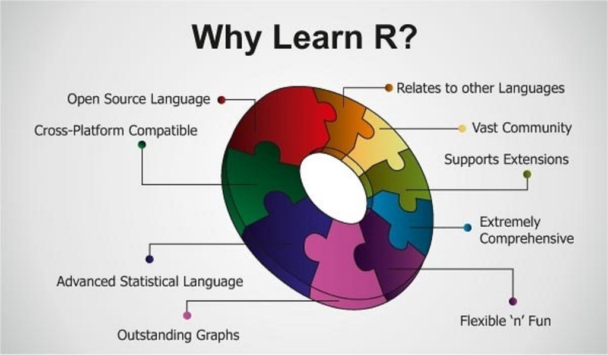

```{r setup, include = FALSE}
library(tidyverse)
```


class: middle, inverse
# Introduction


---
# Welcome

Kirill
- kirill.mueller@unisg.ch
- https://github.com/krlmlr

Christoph
- christoph.sax@unisg.ch
- https://github.com/christophsax

---
class: middle

<figure>
  
  <figcaption style="text-align: right; color: #aaa; font-size: small">Source: Pier Paolo Ippolito</figcaption>
</figure>


---
# What this course is about

- Learning R

- Data transformation

- Visualization

- Modeling

- Reporting

- Managing the data science workflow

---
# Data science workflow
<br>
<figure>
  
  <figcaption style="text-align: right; color: #aaa; font-size: small">Source: Wickham and Grolemund</figcaption>
</figure>


---
# Goal: Reproducible Report

- At the end of the course, you will be able to write a reproducible research report in R.

- Such a report covers the full data science workflow: all steps from data preparation, transformation, visualization modeling up to the final report.

- We would like to cover the whole workflow from data to communication as quickly as possible.


---
# Course Syllabus

- Part 1: Data Transformation

- Part 2: Modeling

- Part 3: Advanced Topics

---
# Part 1: Data Transformation

- 26.9.: Visualization and reporting

- 3.10.: Transforming data I

- 10.10.: R Base  [Due: groups and report topic]

---
# Part 2: Modeling

- 17.10.: Statistical models  [Due: assignment 1]

- 24.10.: Communicating models

- 14.11.: Statistical models II

---
# Part 3: Advanced Topics

- 21.11.: Transforming data II  [Due: assignment 2]

- 28.11.: Data Sources

- 5.12.: Workflow Review I

- 12.12.: Workflow review II  [Due: assignment 3]

- 19.12.: Package building  [Due: report]


---

# Course materials

Data Transformation

- https://r4ds.had.co.nz/


Econometrics in R

- https://www.econometrics-with-r.org/


Class Notes

- Will be on GitHub after the class


---

# Course completion

- ECTS credits: 3

- 70% Group research project

- 30% Individual Homeworks


---
class: middle, inverse
# Group research project


---
# Group research project

- Students must submit a reproducible research report for course completion.

- The research project is written in groups of 2‐3 students.

- Written in RMarkdown, and includes blocks of data transformation, modeling and visualization.

- Collaboration is done on GitHub, a version control platform, which is ideal for collaboratively developing code and research reports.

---
# Contributes 70% to the final grade

  - R skills (40%)

  - Originality (10%)

  - Scientific and presentational style (20%)

  - The same grade is given to all members of the group.

---

# Group presentations

- The report must be presented in class (5 min presentation / 5 min discussion per group).

- We want to start at week 5.

- Completion of the report is not needed at the time of presentation.

- As an early presenter, you present your topic, the current status of your work and some interesting challenges you face. The challenges may be R related, so it is interesting for other groups to learn about them.

---
# Group report

- 7 to 12 pages

- Must be written in RMarkdown

- Collaboration and submission is done via GitHub


---
# Topics

- Any project of your interest

- Serious, fun, personal or general questions

- Should cover the whole data science workflow

  - getting, cleaning, transforming data

  - visualization

  - modeling

  - reporting

---
# Some ideas

- Scrape construction company websites to gain insights on real estate market

- Use Google trend data for product analysis

- Weather analysis at your favorite holiday location

---
# Group building

- Groups of 2‐3

- Group building via Canvas


---
class: middle, inverse
# Individual assignments


---
# Individual assignments

- Each lesson, we will solve some excercises that can be completed at home.

- The excercises of multiple lessons belong to an assignement set.

- There are 3 assignment sets

- Hand-in via GitHub

---
# Due dates

- One week after end of a part

- Assignment 1 (covers part 1):  17.10

- Assignment 2 (covers part 2):  21.11

- Assignment 3 (covers part 3):  12.12.


---
class: middle, inverse
# More admin


---
# Lesson plan

- 45 min

- 15 break and tech support

- 45 min

- We will be available afterwards, if needed.


---
class: middle, inverse
# Infrastructure


---
# Local RStudio instance

- It's best to have R and R Studio installed on you own laptop.

- Help-desk after class

- It should work until the next lesson.

- If you have troubles installing it, contact us.


---
# GitHub

- We collaborate throught GitHub at: https://github.com/unisg-progr-19

- Send an email to some students

- Also install GitHub desktop: https://desktop.github.com/


---
class: middle, inverse

# 26.9.: Visualization and Reporting

---
# Topics for today

1. Admin: Groups, GitHub

1. Discussion of assignment

1. Plotting with {ggplot2}: aesthetics, layers, facets

1. Reporting with {rmarkdown}: Getting started

1. Importing data

1. Assignment

---
# Material

## Git

https://happygitwithr.com/

## Text + scripts

https://krlmlr.github.io/vistransrep/book/

https://github.com/krlmlr/vistransrep-proj

## Exercises

https://krlmlr.github.io/vistransrep/2019-09-unisg/

---
# Data science workflow

<br>
<figure>
  
  <figcaption style="text-align: right; color: #aaa; font-size: small">Source: Wickham and Grolemund</figcaption>
</figure>


---

# {ggplot2}: Basic pattern

```{r eval = FALSE}
ggplot(data, aes(x = ..., ...)) +
  geom_...(...)
```
---

# {ggplot2}: Example

```{r fig.width = 9, fig.height = 5}
ggplot(mpg, aes(x = displ, y = hwy)) +
  geom_point()
```
---

# {ggplot2}: Layers and facets

```{r eval = FALSE}
ggplot(data, aes(...)) +
  geom_...(aes(...), ...) +
  geom_...(aes(...), ...) +
  ... +
  facet_...(...)
```
