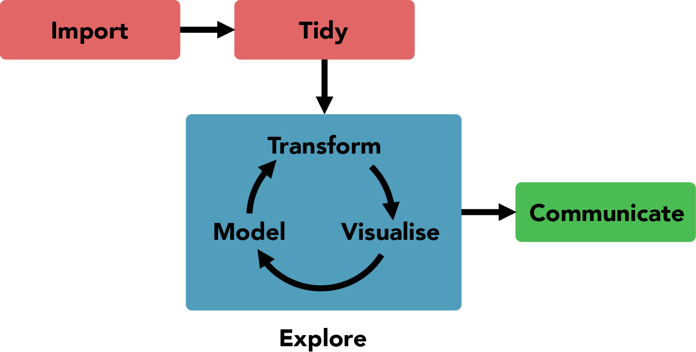

```{r setup, include = FALSE}
library(tidyverse)
set.seed(20191003)
```

class: middle, inverse

# 3.10.: Transformation 1

---
# Topics for today

1. Admin: Graded assignments, groups

1. Review of assignment

1. Data tranformation with {dplyr}: assignment, pipe, verbs

1. Recap plotting with {ggplot2}: layers, facets

---

# Admin

## Graded assignments

Early submission useful for monitoring progress, due on 17.10.

## Groups

Possible topics for final report

Happy to help everyone find a group

---

# Feedback on assignments

## Git

1. Commit messages.
1. Ignoring files.
1. Only commit running code!

## rmarkdown

1. Setup chunk in `.Rmd` file, chunk options.
1. Inline R code.

## Importing

1. Options.


---

# Material


## Text + scripts

https://krlmlr.github.io/vistransrep/book/

https://github.com/krlmlr/vistransrep-proj, in `script/` directory

## Exercises

https://krlmlr.github.io/vistransrep/2019-09-unisg/

## Cheat sheets

https://rstudio.com/resources/cheatsheets/

---
# Material


## Slide deck

https://github.com/rstudio-education/welcome-to-the-tidyverse/blob/master/03-Transform/03-Transform-Slides.pdf, click "Download" for the PDF

---
# Data science workflow

<br>
<figure>
  
  <figcaption style="text-align: right; color: #aaa; font-size: small">Source: Wickham and Grolemund</figcaption>
</figure>


---

# Assignment

`x <- y` pronounced as "`x` _becomes_ `y`"

```{r}
x <- 3
x
x <- x + 1
x
```

---

# The pipe

`x %>% f() %>% g()` pronounced as "`x` _then_ `f` _then_ `g`"

```{r}
f <- function(x) x + 1
g <- function(x) x * 2
```

.pull-left[
```{r}
5 %>% f() %>% g()
```
]

.pull-right[
```{r}
g(f(5)) #<<

## Not:
f(g(5))
```
]

---

# {dplyr}: Basic pattern

```r
data %>%
  verb(...) %>%
  verb(...) %>%
  ...
```

Each `verb` is a **pure function** (doesn't change its input)!

Use assignment to persist the result:

```r
result <-
  data %>% 
  verb(...) ...
```

---

# Verbs

- `filter()`: Removes rows
- `select()`: Removes and renames columns
- `arrange()`: Reorders
- `mutate()`: Creates variables
- `summarize()`: Computes summaries

## Grouped operations

- `group_by()`: Defines grouping for the next operation

---

# {ggplot2}: Pattern, revisited

```{r eval = FALSE}
data %>% 
  ggplot(aes(...)) +
  geom_...(aes(...), ...) +
  geom_...(aes(...), ...) +
  ... +
  facet_...(...)
```

---

# Layers

```{r fig.width = 9, fig.height = 4}
mpg %>% 
  ggplot(aes(x = displ, y = hwy)) +
  geom_jitter() +
  geom_density_2d(aes(color = class))
```

---

# Facets

```{r fig.width = 9, fig.height = 4}
mpg %>% 
  ggplot(aes(x = displ, y = hwy)) +
  geom_jitter() +
  facet_wrap(~year)
```

---
class: inverse
---

# Pure functions

```{r}
f <- function(x) { x <- x + 1; x }
g <- function(x) x * 2
```

...never change their inputs!


.pull-left[
```{r}
x <- 3
x %>% f() %>% g()
x
```
]

.pull-right[
```{r}
y <- x %>% f() %>% g() #<<
y
x
```
]
