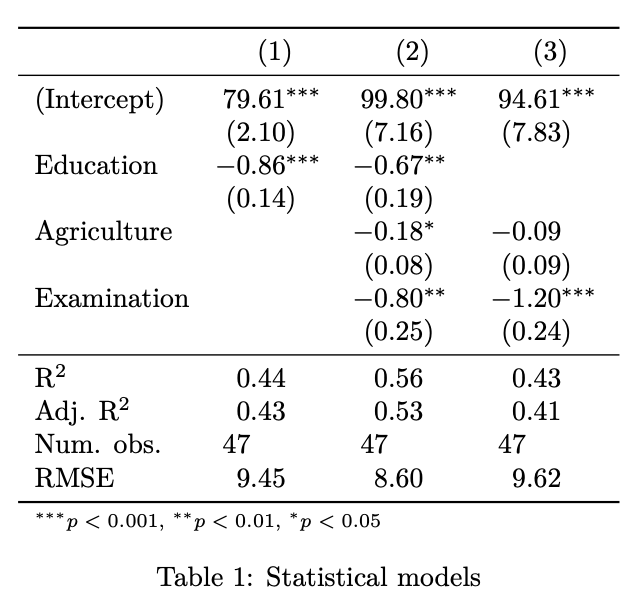
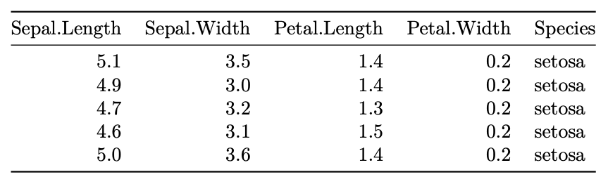

# Regression and Visualization

[Download as R script](07-stats-tables.R)


[Intro Slides](07-statistics-2.html)

We had a first look at linear regression in the last lesson. Today, we are
build on it in two ways. First, we discuss some possibilities to turn
regression output into beautiful tables in your RMarkdown report. Second, we
explore extensions to the linear regression model, to make it a more powerful
and statistically accurate tool to capture linear relationships in data.

## The broom package

In the first few lessons of this course, through dplyr and ggplot, we
explored powerful tools to manipulate data frames. Because we are getting
good at it, we want to use this knowledge to work with regression output (or
any model output) as well. The broom package tries to help, by turning any
model output into a familiar data frame. For more information on the broom
package, check out the
[vignette](https://cran.r-project.org/web/packages/broom/vignettes/broom.html)

broom is an attempt to bridge the gap from untidy outputs of predictions and
estimations to the tidy data we want to work with. It centers around three
methods, each of which take common objects produced by R statistical
functions (`lm()`, `t.test()`, `nls()`, etc) and convert them into a data
frame. broom is particularly designed to work with the dplyr package.


broom provides three functions that do three distinct kinds of tidying.

- `tidy`: constructs a data frame that summarizes the model’s statistical
findings. This includes coefficients and p-values for each term in a
regression, per-cluster information in clustering applications, or per-test
information for multtest functions.

- `augment`: add columns to the original data that was modeled. This includes
predictions, residuals, and cluster assignments.

- `glance`: construct a concise one-row summary of the model. This typically
contains values such as R^2, adjusted R^2, and residual standard error that
are computed once for the entire model.

To see it in action, consider our simple linear regression from last lesson:

````{r }
m <- lm(Fertility ~ Education, data = swiss)
````

We saw that the `summary()` function prints an overview of the regression:

````{r }
summary(m)
````

But this is tedious to work with. It is much easier to have the regression
output in a data frame. To extract the information on the *coefficients*, use
`tidy()`:

````{r }
library(broom)
tidy(m)
````

`augment()` returns statistical information on the *observations*, such as
resiudals and predicted values:

````{r }
augment(m)
````

Finally `glance()` returns summary statistics that are valid for the
regression model:

````{r }
glance(m)
````

## texreg and friends
Publications in Economics usually require regression outputs to be in a
specific form. The *texreg* package gives you professional regression output
for publications out-of-the box.
(There is an alternative solution,
[stargazer](https://cran.r-project.org/web/packages/stargazer/index.html),
but its output has some flaws, especially when used in the PDF mode. E.g.,
it does not support the LaTeX booktab package.)

For a quick demonstration, consider two competing models:

````{r }
m1 <- lm(Fertility ~ Education, data = swiss)
m2 <- lm(Fertility ~ Education + Agriculture + Examination, data = swiss)
m3 <- lm(Fertility ~ Agriculture + Examination, data = swiss)
````

Wrap the model in a `list()` and pass them to `texreg()` (if you want to
produces a PDF) or to `htmlreg()` (if you want to produces a HTML document).

````{r results = 'asis'}
library(texreg)
htmlreg(list(m1, m2, m3), doctype = FALSE, star.symbol = "\\*")
````

Like with any table output, make sure you add the chunk option `results =
'asis'`. This ensures that the code produced by your function (HTML or TeX)
is interpreted as it is, not not simply printed.
`doctype = FALSE` and `star.symbol = "\\*"` are two fixes needed if HTML
content is used within RMarkdown.
There is also a version than produces a text version of the output, which is
useful for quick interactive exploration of the table:

````{r }
screenreg(list(m1, m2, m3))
````

You can give the models a customized name:

````{r results = 'asis'}
htmlreg(
  list(`(1)` = m1, `(2)` = m2, `(3)` = m3),
  doctype = FALSE, star.symbol = "\\*"
)
````

texreg shines when it comes to LaTeX tables, which are often used in
publications. The following line will produce the LaTeX table below

````{r results = 'hide'}
texreg(list(`(1)` = m1, `(2)` = m2, `(3)` = m3), booktabs = TRUE, dcolumn = TRUE)
````



However, because we are using the LaTeX packages `booktabs` (for nicer lines)
and `dcolumn` (for aligned numbers), we need to load these first and adjust
the YAML header as follows:

```yaml
---
output: pdf_document
header-includes:
  - \usepackage{booktabs}
  - \usepackage{dcolumn}
---
```

## From data frame to output: kable

Including any kind of table in a RMarkdown document can be done with the
kable package. The kable package is super simple but sufficient in most
cases, so there is rearely a need to switch to more extensive package like
`gt` or `xtable`. Contrary to texreg, kable is smart enough to see if we want
to produce a PDF or a HTML document. To produce a simple table, just write
`kable()` around a data frame:

````{r }
library(knitr)
kable(iris[1:5,])
````

In a PDF, the output looks like the following:



Customization can be done through the [kableExtra
package](https://haozhu233.github.io/kableExtra/) but the details differ for
[HTML](https://haozhu233.github.io/kableExtra/awesome_table_in_html.html) and
[PDF](https://haozhu233.github.io/kableExtra/awesome_table_in_pdf.pdf). We
won't cover them here, but both are useful sources for documentation to style
your tables according to your needs.


## More on linear regression

We had a quick look at the `lm()` function and linear regressions in R. We
will deepen our knowledge by having another look at these models. This time,
we put more emphasis on the econometric side of the problem.

The following  relies heavily on a new a new online book, [Econometrics in
R](https://www.econometrics-with-r.org/). This chapter covers the content of
chapters 4 to 7. Contrary to the textbook, we will rely on the tools of the
tidyverse, to unfiy the data analysis. We will not cover most of the
statistical topics in the book. The interested reader is refered to the book,
or to the underlying Econometrics textbook, [Introduction to
Econometrics](https://www.pearson.com/us/higher-education/product/Stock-Introduction-to-Econometrics-3rd-Edition/9780138009007.html)
(which is not free).


### Relationship between class size and test score

The book takes a careful look on the impact of class sizes on school test
scores. If, for example, a school cuts its class sizes by hiring new
teachers, that is, the school lowers the student-teacher ratios of its
classes, how would this affect the performance of the students involved in a
standardized test? With linear regression we can not only examine whether the
student-teacher ratio does have an impact on the test results but we can also
learn about the direction and the strength of this effect.

The dataset is included in the
[AER](https://cran.r-project.org/web/packages/AER/index.html) package and can
be loaded as follows:

````{r }
library(AER)
data(CASchools)
````

The dataset contains data on test performance, school characteristics and
student demographic backgrounds for school districts in California. We will
enhance the dataset by defining two new variables, `student_teacher_ratio`,
the student-teacher ratio, and `test_score`, an average of two underlying
test scores:

````{r }
library(tidyverse)
caschools <-
  CASchools %>%
  as_tibble() %>%
  mutate(student_teacher_ratio = students / teachers) %>%
  mutate(test_score = (read + math) / 2)

caschools
````

It is always a good idea to start with a plot. Let us refresh our knowledge
of ggplot:

````{r }
caschools %>%
  ggplot(aes(x = student_teacher_ratio, y = test_score)) +
  geom_point() +
  ggtitle("Test scores are higher in small classes")
````

The plot shows the scatterplot of all observations on the student-teacher
ratio and test score. We see that the points are strongly scattered, and that
the variables are negatively correlated. That is, we expect to observe lower
test scores in bigger classes.

Let's use `lm()` to estimate a linear regression model:

````{r }
m <- lm(test_score ~ student_teacher_ratio, data = caschools)
summary(m)
````

Thus, the coefficient on the `student_teacher_ratio` is about -2.3, i.e., a
reduced class size by one is associated with a test score increased by 2.3.

`geom_smooth()` allows us to plot a bivariate regression line directly into a
ggplot:

````{r }
caschools %>%
  ggplot(aes(x = student_teacher_ratio, y = test_score)) +
  geom_point() +
  geom_smooth(method = "lm", se = FALSE) +
  ggtitle("Test scores are higher in small classes", "with regression line")
````

### Heteroskedasticity-consistent standard errors

In economic contexts, some of the assumptions of the classical regression
model are usually violated, and it recommended and sometimes required to use
robust standard errors. The textbook discusses the case of
heteroskedasticity-consistent standard errors.

The quickest way to compute heteroskedasticity-consistent standard errors is
to use `robust_lm`, from the
[estimatr](https://cran.r-project.org/web/packages/estimatr/index.html)
package.

````{r }
library(estimatr)
m_robust <- lm_robust(
  test_score ~ student_teacher_ratio,
  se_type = "HC1",
  data = caschools
)
summary(m_robust)
````

We can use `htmlreg` (or `screenreg`, for interactive use; or `texreg`)
from above to get a clean overview of the two estimations
(`include.ci = FALSE` is needed for a peculiarity of `lm_robust`):

````{r }
library(texreg)
````
````{r results = "asis"}
htmlreg(
  list(
    `OLS s.e.` = m,
    `heteroskedasticity-consistent s.e.` = m_robust
  ),
  include.ci = FALSE,
  star.symbol = "\\*",
  doctype = FALSE,
  caption = "Robust standard errors are slightly wider."
)
````

Robust standard errors are often wider, making it less likely that an effect
is statistically significant. Whenever possible, use
heteroskedasticity-consistent standard errors.


### Omitted variable bias

The previous analysis of the relationship between test score and class size
has a major flaw: we ignored other determinants of the dependent variable
(test score) that correlate with the regressor (class size). This might
induce an estimation bias. In our example we therefore wrongly estimate the
causal effect on test scores of a unit change in the student-teacher ratio,
on average. This issue is called omitted variable bias (OVB).

Let's have a look at the following relationship between the percentage of
English learners (`english`) and class size:

````{r }
caschools %>%
  ggplot(aes(x = student_teacher_ratio, y = english)) +
  geom_point() +
  geom_smooth(method = "lm", se = FALSE) +
  ggtitle(
    "Larger classes have a larger share of English learners ",
    "with regression line"
  )
````

Since a high share of English learners is likely to have lowering impact on
test scores, this suggests that the effect of small classes is overestimated
as it captures the effect of having fewer English learners, too.

Multiple regression allows us to disentangle the two effects:

````{r }
m_multiple <- lm_robust(test_score ~ student_teacher_ratio + english, se_type = "HC1", data = caschools)
summary(m_robust)

````
````{r results = "asis"}
htmlreg(
  list(
    m_robust,
    m_multiple
  ),
  include.ci = FALSE,
  star.symbol = "\\*",
  doctype = FALSE,
  caption = "Including the share of English learners decreases the coefficient on class size."
)
````

We find that the negative coefficient on `student_teacher_ratio` is still
significant but only half the size.

## Exercises

For this exercise, you will work with Boston, which is part of the
[MASS](https://cran.r-project.org/web/packages/MASS/index.html) package.

1. Load the MASS package, check the documentation to get an overview of the
variables in `Boston`.

2. Convert `Boston` from a data frame to a tibble, called `boston`.

3. Plot a scatter-plot between the percent of households with low
socioeconomic status, `lstat`, (x-axis) and the median house value of
districts `medv`, (y-axis). Describe your observations. How appropriate is
the assumption of linearity?

4. Estimate a simple linear regression model that explains `medv` by `lstat`
and a constant. Save the model to `m_uni`. Use heteroskedasticity-consistent
standard errors.

5. Regress the median housing value in a district, `medv`, on the average age
of the buildings, `age`, the per-capita crime rate, `crim`, the percentage of
individuals with low socioeconomic status, `lstat`, and a constant. Store it
as `m_multi`.

6. Regress `medv` on all available regressors. Use the formula `medv ~ .` as
a short cut. Store the model as `m_full`.

7. Use `htmlreg()` (or `screereg()`, or `texreg()` to produce a regression
output that is ready for publication. Include `m_uni`, `m_multi` and `m_full`.
Check whether the augmented model yields a higher adjusted R2. Why is not
meaningful to compare the unadjusted R2?

8. Can we improve the model (in terms of adjusted R2), by dropping a variable?
Hint: the `glance` function makes it easy to directly access the adjusted R2.


# Transformation 3

[Intro Slides](08-transformation-3.html)
