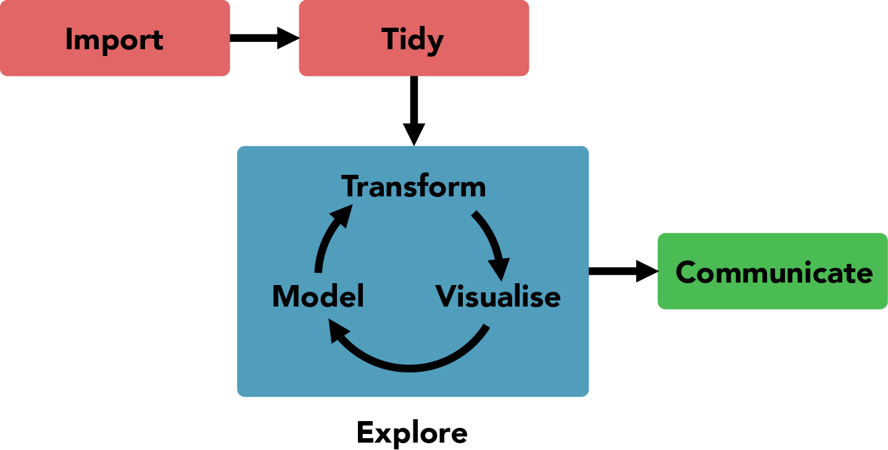

```{r setup, include = FALSE}
library(tidyverse)
```

class: middle, inverse

# 26.9.: Visualization and Reporting

---
# Topics for today

1. Admin: Groups, GitHub

1. Discussion of assignment

1. Plotting with {ggplot2}: aesthetics, layers, facets

1. Reporting with {rmarkdown}: Getting started

1. Importing data

1. Assignment

---
# Material

## Git

https://happygitwithr.com/

## Text + scripts

https://krlmlr.github.io/vistransrep/book/

https://github.com/krlmlr/vistransrep-proj/tree/master/script

## Exercises

https://krlmlr.github.io/vistransrep/2019-09-unisg/

---
# Data science workflow

<br>
<figure>
  
  <figcaption style="text-align: right; color: #aaa; font-size: small">Source: Wickham and Grolemund</figcaption>
</figure>


---

# {ggplot2}: Basic pattern

```{r eval = FALSE}
ggplot(data, aes(x = ..., ...)) +
  geom_...(...)
```
---

# {ggplot2}: Example

```{r fig.width = 9, fig.height = 5}
ggplot(mpg, aes(x = displ, y = hwy)) +
  geom_point()
```
---

# {ggplot2}: Layers and facets

```{r eval = FALSE}
ggplot(data, aes(...)) +
  geom_...(aes(...), ...) +
  geom_...(aes(...), ...) +
  ... +
  facet_...(...)
```
```
